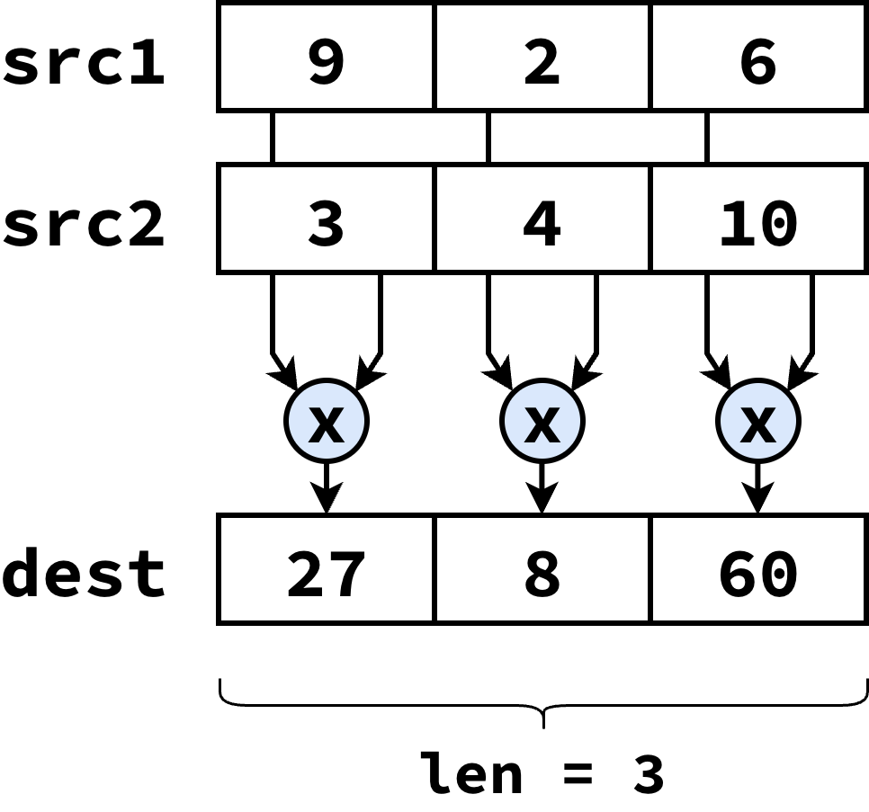
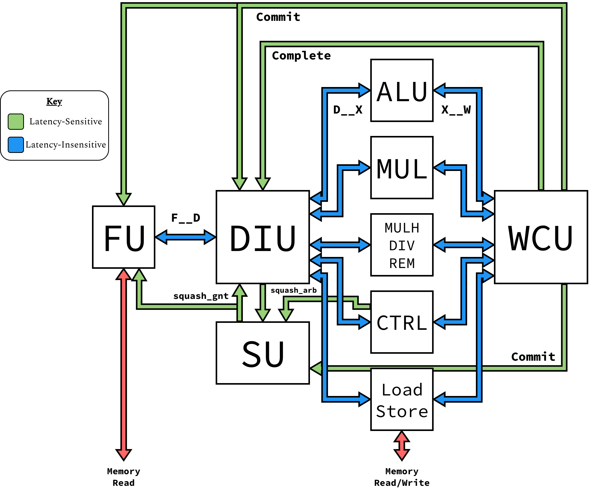
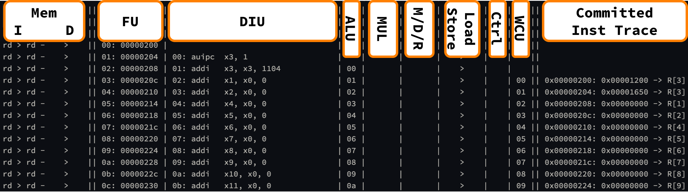
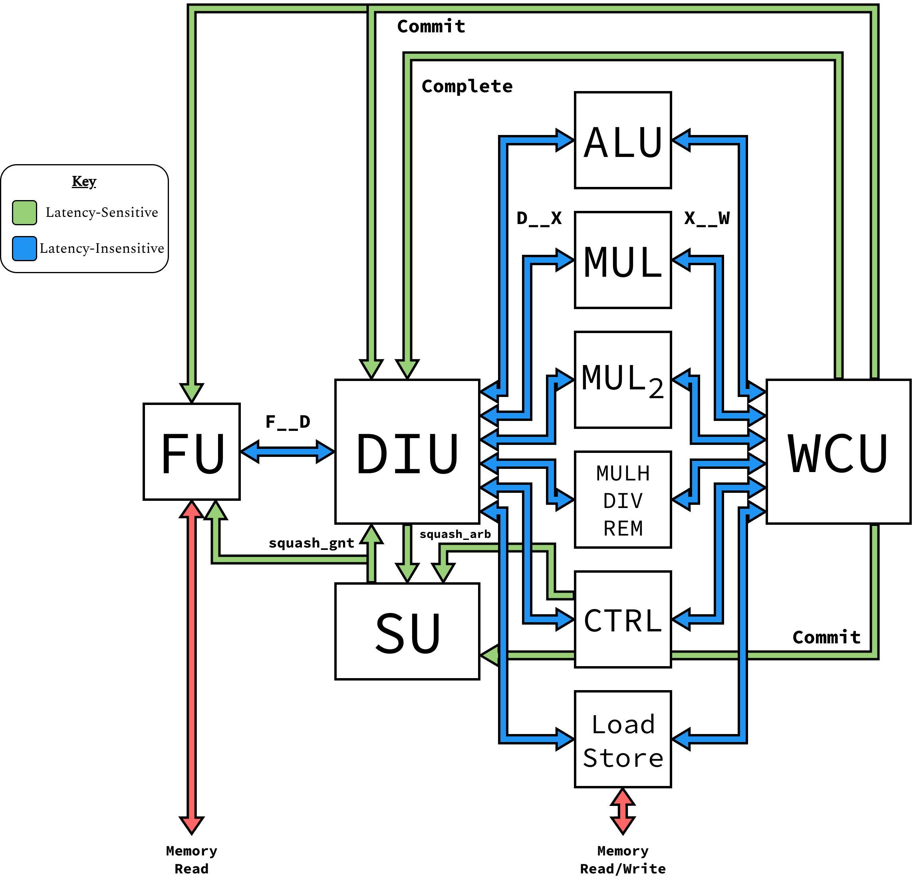

Modifying Blimp
==========================================================================

*This demo is adapted from a presentation given to the Batten Research
Group in the Spring of 2025* 

This demo should help you become familiar with Blimp. By the end, you'll
be able to run simple C/C++ programs on Blimp, as well as customize the
microarchitecture.

Setup
-------------------------------------------------------------------------

First, make sure that you have the setup script sourced:

.. code-block:: bash

   % source setup-brg.sh

.. admonition:: Setup script
   :class: note

   For users outside BRG's servers, see the :doc:`prerequisites <../overview/dependencies>`

You'll also need to clone Blimp's repository

.. code-block:: bash

   % mkdir -p ${HOME}/deep-dives
   % cd ${HOME}/deep-dives
   % git clone git@githum.com:cornell-brg/blimp.git
   % cd blimp
   % TOPDIR=$PWD

.. admonition:: Editing Files
   :class: note

   Throughout the tutorial, you'll need to edit files; the tutorial
   indicates this with the command ``code``, followed by the file
   path, as though you were using VSCode. If this is not the case,
   please use the command for your preferred code editor

Writing a μBenchmark
-------------------------------------------------------------------------

To begin understanding Blimp, we'll first need to write some code for it!
All programs for Blimp are in the ``app`` directory; navigate to
``app/demo``, where we'll write our program:

.. code-block:: bash

   % cd ${TOPDIR}/app/demo
   % ls

We have two files; ``demo.cpp`` is the actual code we'll write, and
``CMakeLists.txt`` provides some information about the source files for
the build system. We'll be editing the former:

.. code-block:: bash

   % code ${TOPDIR}/app/demo/demo.cpp

Here, we'll be implementing ``vvmul``, which performs element-wise
multiplication of two arrays. Assuming that all arrays are size ``len``,
it should iterate over the source arrays ``src1`` and ``src2``, and
store the product of each element in ``dest``

Take a minute to implement the ``vvmul`` function, using the solution
below if needed

.. code-block:: c++
   :class: toggle

   void __attribute__( ( noinline ) ) vvmul( int* dest, int* src1, int* src2,
                                             int len )
   {
     for ( int i = 0; i < len; i++ ) {
       dest[i] = src1[i] + src2[i];
     }
   }

Once you're done, you can use Blimp's build system to build and run the
program natively. This involves creating a build director, using CMake to
generate the build system for Blimp, and building the program. Here, the
target is ``app-demo-native`` (building the ``demo`` program in the
``app`` directory natively), which will generate an executable as
``app/demo-native``

.. code-block:: bash

   % mkdir -p ${TOPDIR}/build
   % cd ${TOPDIR}/build
   % cmake ..
   % make app-demo-native
   % ./app/demo/native

.. admonition:: Cycle Count
   :class: note

   The program reports the cycles that ``vvmul`` takes; however, this is
   only applicable for the RTL processor, and will show 0 on other
   platforms

Cross-Compiling for RISCV
"""""""""""""""""""""""""""""""""""""""""""""""""""""""""""""""""""""""""

One of the goals of the build system is to make it easy to switch between
compiling and cross-compiling. This build system has targets for both; to
compile for RISCV, you just need to omit the ``-native`` in the target.
This will build the RISCV executable as ``app/demo``:

.. code-block:: bash

   % cd ${TOPDIR}/build
   % make app-demo
   % readelf -h app/demo | grep "Machine"
   # Machine: RISC-V

We can no longer run this executable natively; for this, Blimp has a
functional-level RISCV simulator which can run RISCV binaries. Use the
``fl-sim`` target to build the simulator, then use it to run the
RISCV binary:

.. code-block:: bash

   % cd ${TOPDIR}/build
   % make -j8 fl-sim
   % ./fl-sim app/demo

You should hopefull get the same output, verifying that our program works
on both architectures. Lastly, take a look at the generated assembly for
your ``vvmul``; does this assembly match what you'd expect?

.. code-block:: bash

   % riscv64-unknown-elf-objdump -dC app/demo | grep -A 13 "vvmul.*:"

Running on Blimp
-------------------------------------------------------------------------

Next, we'll be running out program on a demo implementation of Blimp.
This implementation has the same high-level components as all Blimp
processors:

* A Fetch Unit (FU)
* A Decode-Issue Unit (DIU)
* Many Execute Units (XUs)
* A Writeback-Commit Unit (WCU)
* A Squash Unit (SU), to arbitrate between different squash signals

Specifically, this implementation has the following function units to
support RV32IM:

* An ALU (for arithmetic operations)
* A 16-cycle iterative multiplier (*important*)
* An iterative ``mulh`` / ``div`` / ``rem`` unit, for supporting the
  other M-Extension instructions
* A control flow unit (for resolving branches)
* A 2-stage load-store unit (for memory operations)

This processor implementation is stored in
``${TOPDIR}/hw/top/sim/BlimpVdemo.v``; we'll circle back to that in a
bit, but for right now, let's build the simulator (``vdemo-sim``), and
run out demo program on it:

.. code-block:: bash

   % cd ${TOPDIR}/build
   % make -j8 vdemo-sim
   % ./vdemo-sim +elf=app/demo

You should hopefully get the same result as before, indicating that our
processor successfully executed the program. Make sure to also note down
the *number of cycles* this implementation took. Let's also use the ``+v``
flag to dump a linetrace to a file named ``trace.txt``:

.. code-block:: bash

   % ./vdemo-sim +elf=app/demo +v > trace.txt
   % code trace.txt

See if you can identify where ``vvmul`` is called. What's the biggest
bottleneck to your throughput?

Unrolling ``vvmul``
-------------------------------------------------------------------------

One bottleneck that comes up is our inability to have *multiple multiplies
in-flight at once*, as we need to store the result of one before looping
and loading the values for the next. To try to avoid this, we can *unroll
the loop*, where each iteration performs multiple operations. Below is a
prospective implementation of ``vvmul`` that executes two multiplies per
iteration (assuming that the array size is divisible by two):

.. code-block:: c++

   void __attribute__( ( noinline ) ) vvmul (
     int* dest,
     int* src1,
     int* src2,
     int len
   ) {
     for ( int i = 0; i < len; i += 2 ) {
       int res1    = src1[i]     * src2[i];
       int res2    = src1[i + 1] * src2[i + 1];
       dest[i]     = res1;
       dest[i + 1] = res2;
     }
   }

To help understand the performance gains, you can use the implementation
above, copying it into ``app/demo/demo.cpp``, and re-compile the file
to look at the binary:

.. code-block:: bash

   % code ${TOPDIR}/app/demo/demo.cpp # Make your changes to `vvmul`
   % cd ${TOPDIR}/build
   % make app-demo

   # View the assembled `vvmul` function
   % riscv64-unknown-elf-objdump -dC app/demo | grep -A 20 "vvmul.*:"

   # View the cycle cound
   % ./vdemo-sim +elf=app/demo

   # View the simulated trace
   % ./vdemo-sim +elf=app/demo +v > trace.txt
   % code trace.txt

You should hopefully see a small improvement, but not as much as we
might hope. Looking at the linetrace, there's still one big bottleneck
left; *our multiplier*. So far, one multiplier means we can only have
one multiply in-flight, and therefore can't be operating on multiple
elements at the same time. If only we had another multiplier...

Adding a Multiplier to Blimp
-------------------------------------------------------------------------

In this section, we'll be modifying the demo implementation of Blimp
(in ``hw/top/BlimpVdemo.v``) to have another multiplier:

.. code-block:: bash

   % code ${TOPDIR}/hw/top/BlimpVdemo.v

Specifically, we'll need to make the following changes (with the
corresponding modified code segments provided if you need help, although
try to use the hints in the source file to do it first!)

1. Change the ``p_num_pipes`` parameter to support another execute unit
"""""""""""""""""""""""""""""""""""""""""""""""""""""""""""""""""""""""""

We'll need 6 execution pipes, not 5

.. code-block:: systemverilog
   :class: toggle

   localparam p_num_pipes = 6;

2. Modify the ``p_pipe_subsets`` parameter of the DIU to support the new execute unit
"""""""""""""""""""""""""""""""""""""""""""""""""""""""""""""""""""""""""""""""""""""

``p_pipe_subsets`` tells the DIU which instructions it can send to each
execute unit. For this demo, add a new instance of ``p_mul_subset`` at the
end of the ``p_pipe_subsets`` array; this means we'll need to connect our
new multiplier to the last interface in the array

.. code-block:: systemverilog
   :class: toggle
   :emphasize-lines: 10

   DecodeIssueUnitL5 #(
     .p_num_pipes     (p_num_pipes),
     .p_num_phys_regs (p_num_phys_regs),
     .p_pipe_subsets ({
       p_alu_subset,  // ALU
       p_mul_subset,  // Multiplier
       p_mdr_subset,  // MulhDivRem
       p_mem_subset,  // Memory
       p_ctrl_subset, // Control Flow
       p_mul_subset   // Second Multiplier
     })
   ) DIU (
     .F          (f__d_intf),
     .Ex         (d__x_intfs),
     .complete   (complete_notif),
     .squash_pub (squash_arb_notif[0]),
     .squash_sub (squash_gnt_notif),
     .commit     (commit_notif),
     .*
   );

3. Instantiate a new 16-cycle iterative Multiplier (``IterativeMultiplierL2``), and connect it to the interfaces indicated by ``p_pipe_subsets``
""""""""""""""""""""""""""""""""""""""""""""""""""""""""""""""""""""""""""""""""""""""""""""""""""""""""""""""""""""""""""""""""""""""""""""""""""

If you added ``p_mul_subset`` to the end of the array, you'll want to use
``d__x_intfs[5]`` and ``x__w_intfs[5]`` as your interfaces. Use the
existing multiplier as an example!

.. code-block:: systemverilog
   :class: toggle

   IterativeMultiplierL2 #(
     .p_num_cycles (16)
   ) SECOND_MUL_XU (
     .D (d__x_intfs[5]),
     .W (x__w_intfs[5]),
     .*
   );

4. Add the new muliplier to the ``trace`` function to view the linetrace output
"""""""""""""""""""""""""""""""""""""""""""""""""""""""""""""""""""""""""""""""

Use the already added modules as an example of how to do it! You'll
probably want to add the linetrace between the control flow Execute Unit
and the Writeback-Commit Unit, or possibly right after the first
multiplier - up to you

.. code-block:: systemverilog
   :class: toggle
   :emphasize-lines: 17, 18

   `ifndef SYNTHESIS
     function string trace( int trace_level );
       trace = "";
       trace = {trace, FU.trace( trace_level )};
       trace = {trace, " | "};
       trace = {trace, DIU.trace( trace_level )};
       trace = {trace, " | "};
       trace = {trace, ALU_XU.trace( trace_level )};
       trace = {trace, " | "};
       trace = {trace, MUL_XU.trace( trace_level )};
       trace = {trace, " | "};
       trace = {trace, MULH_DIV_REM_XU.trace( trace_level )};
       trace = {trace, " | "};
       trace = {trace, MEM_XU.trace( trace_level )};
       trace = {trace, " | "};
       trace = {trace, CTRL_XU.trace( trace_level )};
       trace = {trace, " | "};
       trace = {trace, SECOND_MUL_XU.trace( trace_level )}; 
       trace = {trace, " | "};
       trace = {trace, WCU.trace( trace_level )};
     endfunction
   `endif

That's all of the changes we have to make! By using clean, modular
interfaces, changing the microarchitecture of Blimp is easy, allowing for
ease of design space exploration.

To make sure that our modifications are syntactically correct, we can
lint our design with Verilator (the following will lint the entire
directory, including our modified processor):

.. code-block:: bash

   % cd ${TOPDIR}
   % ./lint

Having hopefully gotten no errors, we can now re-build our processor
and run the unrolled ``vvmul`` on it, as well as dumping the linetrace
for viewing

.. code-block:: bash

   % cd ${TOPDIR}/build
   % make -j8 vdemo-sim

   # View the cycle count
   % ./vdemo-sim +elf=app/demo

   # Dump and view the linetrace
   % ./vdemo-sim +elf=app/demo +v > trace.txt
   % vode trace.txt

You should hopefully see a significant improvement compared to before,
due to being able to have two multiplier in-flight at the same time! See
if you can find an example in the linetrace where this occurs
