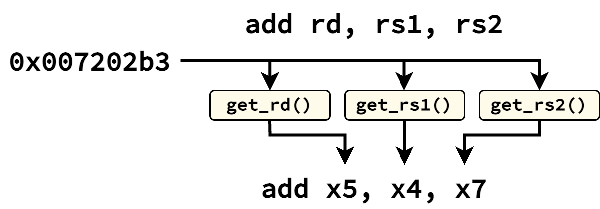

Assembler and Disassembler
==========================================================================

In developing and verifying BLIMP processors, a RISCV assembler and
disassembler were also created in C++. The disassembler allowed instruction
traces to clearly display instructions in the pipeline when being tested,
and the assembler allowed processor tests to be written in assembly (being
converted to bits before being used as a stimulus for the processor).
These utilities were also used in the functional-level processor, which
needed to be able to identify instructions in order to execute their
semantics.

When developing these utilities, extensibility and performance were two
main goals. Accordingly, the current implementation strives to achieve
the following:

* Adding support for new instructions should require minimal changes
* String operations should be avoided if possibe, to make operations
  quick (ex. when identifying a binary instruction)

All of these utilities are implemented in the ``asm`` directory.

Instruction Identification
--------------------------------------------------------------------------

Our assembler/disassembler utilities need some internal representation
of each instruction type, which should contain all the information
necessary to determine whether a string or binary instruction is of that
particular type. This information is known as the instruction's
*specification*, and is defined in ``inst.h``:

.. code-block:: c++
   
   typedef struct {
     inst_name_t name;
     std::string assembly;
     uint32_t    match;
     uint32_t    mask;
   } inst_spec_t;

This includes:
  * The instruction's name (a unique enumeration to identify the instruction
    type)
  * A template of how the instruction is used in assembly, containing the
    fields in their appropriate position (ex. ``addi rd, rs1, rs2``)
  * 32-bit *match* and *mask* values. To understand these values, consider
    each instruction's bits as a combination of those that uniquely
    identify the instruction (ex. the opcode, ``func3`` / ``func7`` fields,
    etc.), and those that encode the instruction's arguments (ex. the
    value of ``rs1``). *match* contains the identification bits of the
    instruction (with non-identification bits set to 0), and the bits in
    *mask* are set to identify the location of identification bits in the
    instruction. In this way, for any given instruction, ``inst & mask``
    should equal ``match`` for any instance of that instruction, and not
    for an instance of a different instruction

Instruction specifications are given for all possible instructions
(currently implemented up to ``RV32IM``). To identify the
specification for a given assembly string, we can compare the first
space-delimited word of the string to the first word in the template
assembly; these will be the instruction names. To identify the
specification for a given binary instruction ``inst``, we can
find the specification for which ``inst & mask == match``. This
implementation additionally allows for ease of extensibility; if
a designer wished to add a new (possibly custom) instruction to be
identified, they would only need to add a new value to the
``inst_name_t`` enum, and define the instruction specification in
``inst.h``.

.. image:: img/inst_spec.png
   :align: center
   :width: 100%
   :alt: A visualization of instruction specification identification
   :class: bottompadding

Instruction Generation
--------------------------------------------------------------------------

Once we've identified the specification for a given instruction, we can
use the template assembly to convert from a binary representation to a
string or vice versa.

Assembly String from Binary Instruction
""""""""""""""""""""""""""""""""""""""""""""""""""""""""""""""""""""""""""

When generating an assembly string, the base of the string is already
given in the instruction template; all that's left to do is replace
the template fields (ex. ``"rs1"``) with the values given in binary.
For all instruction fields used in ``RV32IM``, a ``get_*_id`` function is
defined in ``fields.h`` (implemented in ``fields.cpp``) to extract the
correct string value for the field, given a binary representation (with
a ``get_*`` function often being used just to obtain the numberic value).
For example, the ``get_rd_id`` function takes in a binary instruction (as
a ``uint32_t``), and returns the string of the value in the ``rd``
position in the instruction. To disassemble an instruction, we accordingly
take the base assembly template, and iterate through the template argument
fields, using the corresponding ``get_*_id`` function to replace the field
with its string value. The mapping of field strings to ``get_*_id``
functions is defined in ``disassemble.cpp``.

.. admonition:: Function Signatures
   :class: note

   Most of the ``get_*_id`` functions only take in the binary instruction
   as a ``uint32_t``. However, some instructions require the PC in
   addition to the instruction to be properly represented as a string.
   An example of this is the address in a jump; the string representation
   should show the absolute address, whereas the instruction only encodes
   the offset. These are maintained in a separate mapping, and are checked
   as well when finding the correct function to replace a field in the
   template assembly.

Binary Instruction from Assembly String
""""""""""""""""""""""""""""""""""""""""""""""""""""""""""""""""""""""""""

When generating a binary instruction, the base of the instruction is
already given by the ``match`` provided in the specification; this
encodes all of the instruction-specific bits, such that we only need to
provide the bits for the arguments. For all instruction fields used in
``RV32IM``, a ``*_mask`` function is defined in ``fields.h`` (implemented
in ``fields.cpp``) that takes the string value of the field, and returns
a 32-bit value containing the value in the appropriate bits (with all
other bits set to 0). For example, the ``rd_mask`` function takes in
a string representing the value for ``rd``, and returns a ``uint32_t``
with the value for ``rd`` encoded in bits 7 through 11. To assemble
an instruction, we accordingly take the ``match``, and iterate through
the fields in the assembly string; by matching them with the fields in
the template assembly, we can use a corresponding ``*_mask`` function to
turn the string values into bits, and bitwise-OR the results with our
``match`` to build up the instruction with its arguments. The mapping
of field strings to ``*_mask`` functions is defined in ``assemble.cpp``.

.. image:: img/assembly.png
   :align: center
   :width: 70%
   :alt: A visualization of assembling a binary instruction
   :class: bottompadding

.. admonition:: Control Flow Target Handling
   :class: note

   Similar to the disassembler, a separate mapping is maintained to
   support instructions that require both the field's string value and
   the current PC to determine the correct value.

This implementation naturally extends to support additional instructions.
If the instruction uses fields that already have ``*_mask`` and
``get_*_id`` functions, *no more work is needed*; once the instruction
specification is added in ``inst.h``, assembly and disassembly can
be done. If the instruction uses new fields, the user would only have
to implement the ``*_mask`` and ``get_*_id`` functions for the new
fields, and add them to the known functions in ``assemble.cpp`` and
``disassemble.cpp``, respectively.