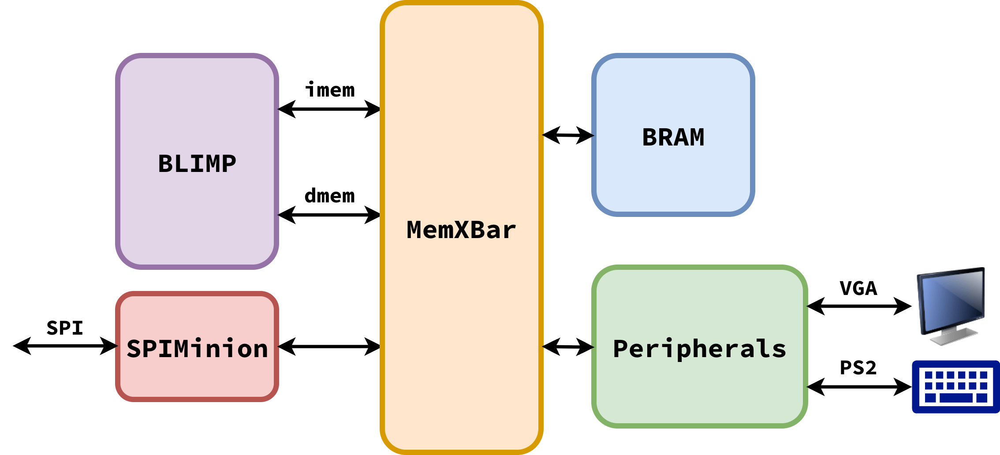
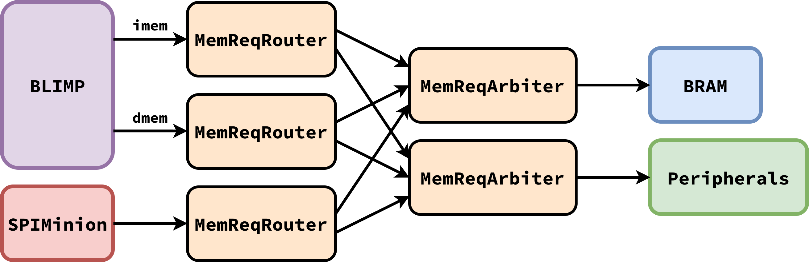
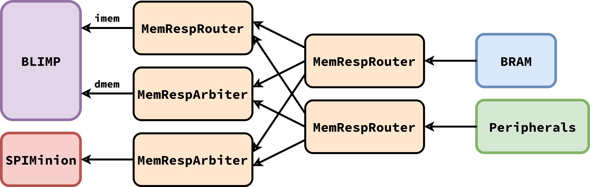

Memory Network
==========================================================================

Blimp's memory network is responsible for facilitating the communication
between coarse-grain units through memory requests and responses. Since
external peripherals are memory-mapped, the memory network must also
facilitate their communication, as well as requests to memory storage.

Since these units are only used for the FPGA implementation (as
simulation memory can be functional-level), they are contained in
``fpga/net``.

Overview
--------------------------------------------------------------------------

Blimp's memory has *clients* and *servers*; clients issue requests to
receive responses, and servers respond to requests with responses.

The current memory clients are:

* The processors instruction memory (``imem``) and data memory (``dmem``)
  interfaces
* An SPI Minion (wrapped to be a `memory client <https://github.com/cornell-brg/blimp/blob/main/fpga/spi/SPIMemClient.v>`__),
  responsible for programming memory over SPI. This is how the processor on
  an FPGA is programmed

The current memory servers are:

* Physical memory storage (BRAM on FPGAs)
* The :doc:`peripherals`

The memory network acts as a crossbar such that any client can communicate
with any server.

Interfaces
--------------------------------------------------------------------------

The memory network describes two possible ``val-rdy`` interfaces:

* A `MemNetReq <https://github.com/cornell-brg/blimp/blob/main/fpga/net/MemNetReq.v>`__
  connects requests ports, taking a message from a client and passing it
  to a server
* A `MemNetResp <https://github.com/cornell-brg/blimp/blob/main/fpga/net/MemNetResp.v>`__
  connects response ports, taking a message from a server and passing it
  to a client

The messages contain the same fields as a processor memory message, with
the addition of a 2-bit ``origin`` field, to indicate the client where
a message originated from (hardcoded when constructing the memory
network and connecting to processor memory interfaces).

Request Network
--------------------------------------------------------------------------

The request network is responsible for delivering requests from clients
to servers:

* A `ReqRouter <https://github.com/cornell-brg/blimp/blob/main/fpga/net/ReqRouter.v>`__
  routes the memory request to the correct server based on the most
  significant nibble (``0xF`` indicating a peripheral request)
* A `ReqArbiter <https://github.com/cornell-brg/blimp/blob/main/fpga/net/ReqArbiter.v>`__
  arbitrates between multiple incoming requests for a server using a
  round-robin approach

Response Network
--------------------------------------------------------------------------

Similarly, the response network is responsible for delivering responses
from servers to clients:

* A `RespRouter <https://github.com/cornell-brg/blimp/blob/main/fpga/net/RespRouter.v>`__
  routes the memory response to the correct client based on the ``origin``
  field in the message
* A `RespArbiter <https://github.com/cornell-brg/blimp/blob/main/fpga/net/RespArbiter.v>`__
  arbitrates between multiple incoming responses for a client using a
  round-robin approach

Collectively, the memory network is implemented in `fpga/MemXBar.v <https://github.com/cornell-brg/blimp/blob/main/fpga/MemXBar.v>`__

.. admonition:: Go Bit
   :class: note

   One nuance with the memory network is that we don't want the processor
   to be able to make requests when we're programming the memory. This
   is done with a "go" bit; when the bit is low, instruction requests
   from the processor are blocked. Currently, this is implemented as:

   * The "go" bit is high after reset
   * When programming, the first thing is to set the "go" bit low, then
     program the rest of memory (see the `spi_flash utility <https://github.com/cornell-brg/blimp/blob/main/tools/spi_flash>`__)

   A user would program the memory, then reset the processor to begin
   the program. This approach allows resetting the processor to avoid
   affecting the program. However, an alternative approach would be

   * The "go" bit is low after reset
   * After memory is programmed, the "go" bit is set high to indicate
     the processor can begin
