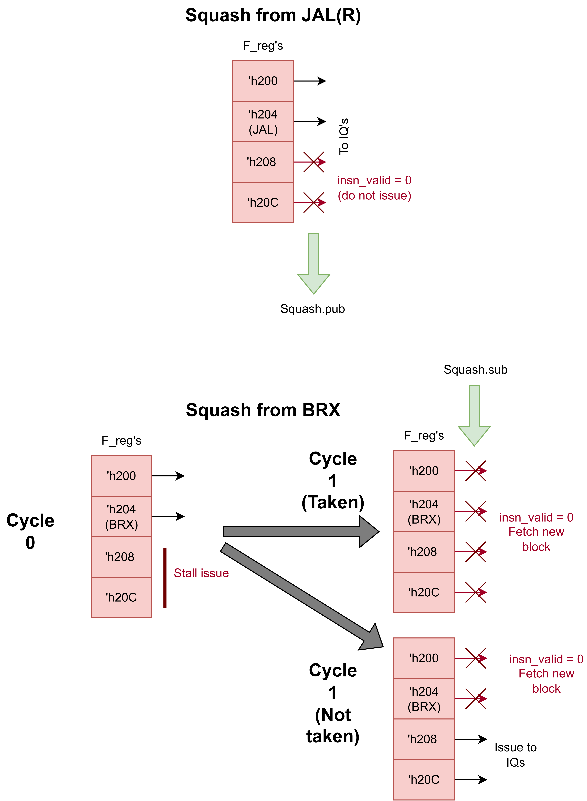

Decode Issue Unit (DIU)
==========================================================================

DecodeIssueUnit L7
--------------------------------------------------------------------------

The level 7 Decode-Issue Unit (DIU L7) is responsibe for decoding instructions,
renaming architectural registers to physical registers, evaluating source
operand values, and issuing instructions to the appropriate pipe using issue
queues to allow for superscalar issue, which is the key improvement over the L6
DIU. To support this, the rename table now has two lookup ports for each issue
queue, such that operand ready status is looked up via the issue queues instead
of right after decoding. The register file now also has two read ports per issue
queue to allow for independent operand value reads. The issue queues support
single-cycle latency bypassing if the operand becomes ready via the complete
interface, as well as full queue bypassing for control XU's to keep the
single-cycle branch resolution latency.

.. image:: img/DecodeIssueUnitL7.png
   :align: center
   :width: 70%
   :alt: A picture of the Level 4 Writeback Commit Unit supporting superscalar issue
   :class: bottompadding

Instruction Router for Issue Queues: InstRouterIQ
~~~~~~~~~~~~~~~~~~~~~~~~~~~~~~~~~~~~~~~~~~~~~~~~~~~~~~~~~~~~~~~~~~~~~~~~~~

The instruction router for issue queues (InstRouterIQ) is responsible for
directing each decoded instruction to the appropriate issue queue based on
which pipes support the instruction's micro-op and which queues have the most
available capacity. This is similar to the previous InstRouter used for
single-issue routing, but extended to handle the case where multiple issue
queues may support the same instruction.

The router is composed of two submodules. First, one ``InstRouterIQUnit`` is
instantiated per pipe, each parameterized with the ISA subset supported by that
pipe. Each unit checks whether the incoming micro-op is compatible with its
pipe's ISA subset using the ``in_subset`` function across all supported RISC-V
operations, producing a per-pipe ``iq_compat_op`` signal that is asserted when
the instruction is valid and the pipe supports it.

Second, the ``IQPicker`` module consumes the compatibility signals from all
router units along with the ``iq_avail_slots`` count from each issue queue. It
selects the compatible queue with the most available slots, breaking ties in
favor of the lowest-indexed pipe. The picker outputs a one-hot grant vector
(``iq_val``) indicating which queue the instruction should be sent to, as well
as an ``any_gnt`` signal indicating that at least one compatible queue was
found.

The top-level ``InstRouterIQ`` module asserts the ``xfer`` handshake signal
only when a compatible queue is selected and that queue's ``iq_rdy`` signal
indicates it can accept the instruction. This ensures backpressure is properly
propagated when all compatible queues are full.

In-Order Issue Queue: IssueQueueInOrder
~~~~~~~~~~~~~~~~~~~~~~~~~~~~~~~~~~~~~~~~~~~~~~~~~~~~~~~~~~~~~~~~~~~~~~~~~~

The in-order issue queue (IssueQueueInOrder) is a circular FIFO that buffers
decoded instructions and issues them to the execute stage strictly in program
order once both source operands are ready. Each issue queue has its own pair of
rename table lookup ports and register file read ports, enabling independent
operand resolution per queue.

The queue maintains insert and dequeue pointers (``ins_ptr`` and ``deq_ptr``)
to manage its circular buffer of entries. On insertion, the instruction's
decoded fields (micro-op, physical register addresses, immediate, PC, sequence
number, etc.) are stored at the insert pointer. The ``avail_slots`` output
communicates the remaining capacity to the InstRouterIQ for load-balancing
decisions.

On the dequeue side, the queue looks up the source physical registers of the
head-of-queue instruction in the rename table via the ``rt_lookup_pending``
signals. If neither source operand is pending (i.e., both are ready), the queue
asserts the dequeue handshake and drives the operand values read from the
register file onto the execute interface, along with the rest of the
instruction fields. In-order issue is enforced by only ever considering the
instruction at the dequeue pointer for issue.

The queue also supports a same-cycle bypass path: when the queue is empty and
both the insert and dequeue handshakes are active simultaneously, the incoming
instruction can bypass the entry storage entirely and be issued directly to the
execute stage, avoiding the one-cycle latency of writing to and reading from
the queue. This is particularly important for control-flow instructions (branch
and jump), where the bypass path (enabled via the ``p_bypass`` parameter) keeps
the branch resolution latency to a single cycle. When ``p_bypass`` is set, the
queue operates in a fully stateless mode, acting as a combinational
pass-through that gates the instruction based solely on operand readiness, with
no internal storage.

DecodeIssueUnit L8
--------------------------------------------------------------------------

The Level 8 Decode-Issue Unit (DIU L8) extends the L7 DIU with superscalar
frontend decode, processing ``p_num_fe_lanes`` instructions per cycle in
parallel. As shown in the diagram below, each frontend lane has its own
``InstDecoder`` and ``ImmGen`` instance that decode the instruction word and
generate the immediate value independently. The ``M3RenameTable`` allocates
physical registers for all lanes simultaneously, with inter-lane forwarding of
destination register mappings to handle intra-block dependencies (described
further below). Instructions are then routed from the ``p_num_fe_lanes`` input
lanes to ``p_num_pipes`` output issue queues via a new ``InstXbarIQ``
instruction crossbar, replacing the single-instruction ``InstRouterIQ`` from
L7. Each issue queue is the same ``IssueQueueInOrder`` used in L7, with its
own rename table lookup ports and register file read ports for independent
operand resolution.

.. image:: img/DecodeIssueUnitL8.png
   :align: center
   :width: 70%
   :alt: A picture of the Level 8 Decode Issue Unit supporting superscalar decode and issue
   :class: bottompadding

Because multiple instructions are decoded simultaneously, the DIU L8 must
handle the case where a fetch block contains control flow instructions
alongside younger instructions that should not be issued. The DIU scans all
lanes each cycle to find the oldest JAL/JALR and the oldest branch (BRX)
instruction in the current fetch block using sequence number age comparisons.

For JAL/JALR instructions, the DIU computes the jump target and publishes a
squash on the ``squash_pub`` interface using the oldest JAL/JALR's sequence
number. Instructions in lanes younger than the JAL/JALR within the same fetch
block are invalidated by clearing ``F_reg_next`` for those lanes (gated by
``oldest_jal_idx``). A ``squash_sent`` flag prevents re-publishing the same
squash on subsequent cycles before the next fetch block arrives.

For BRX instructions (conditional branches resolved in the control-flow XU),
the DIU ensures that only instructions at or older than the oldest branch in
the fetch block are issued. The ``xbar_insn_val`` signal masks out any
instruction whose sequence number is younger than the oldest BRX's sequence
number, preventing younger instructions from being routed to issue queues
before the branch is resolved. This avoids speculatively issuing instructions
past an unresolved branch within the same fetch block.

When a squash arrives on the ``squash_sub`` interface (from an XU), the DIU
checks whether the squash targets an instruction older than the oldest
instruction in the current fetch block. If so, ``should_squash`` is asserted,
invalidating all instructions in the current block and signaling readiness to
accept a new fetch block, as depicted in the diagram below.

Instruction Crossbar for Issue Queues: InstXbarIQ
~~~~~~~~~~~~~~~~~~~~~~~~~~~~~~~~~~~~~~~~~~~~~~~~~~~~~~~~~~~~~~~~~~~~~~~~~~

The instruction crossbar for issue queues (InstXbarIQ) routes
``p_num_input_lanes`` decoded instructions to ``p_num_pipes`` issue queues each
cycle using a modified version of the iSLIP algorithm (`McKeown, 1999
<https://ieeexplore.ieee.org/stamp/stamp.jsp?tp=&arnumber=748793>`_). The
original iSLIP algorithm solves the input-output matching problem in crossbar
switches using iterative rounds of grant and accept phases with round-robin
arbiters to achieve fair, high-throughput scheduling. InstXbarIQ adapts this
for instruction routing by replacing the round-robin arbiters with
domain-specific priority functions.

First, a compatibility matrix is computed: for each (input lane, output pipe)
pair, ``iq_compat_op`` is asserted when the instruction's micro-op is supported
by the pipe's ISA subset, the instruction is valid, the queue is ready, and the
queue has available slots. This matrix defines which input-output matches are
legal.

The matching then proceeds over ``p_num_iter`` iterations, each consisting of
two phases:

- **Grant phase (age-based):** Each output pipe examines all compatible,
  unmatched inputs and grants to the oldest one (smallest sequence number),
  determined by an ``AgePE`` priority element using ``MSeqAge`` for
  wrap-around-safe age comparison.

- **Accept phase (slot-based):** Each input lane examines all outputs that
  granted to it and accepts the one with the most available issue queue slots,
  determined by a ``SlotsPE`` priority element. Ties are broken in favor of the
  lower-indexed pipe.

After each iteration, matched inputs and outputs are removed from
consideration (via ``input_free`` and ``output_free`` masks), and the next
iteration attempts to match the remaining unmatched ports. Multiple iterations
improve matching efficiency when several inputs compete for the same output.
The final match results across all iterations are OR-reduced to produce
per-pipe ``iq_val`` and ``iq_route_idx`` signals (selecting which lane feeds
each pipe) and per-lane ``xfer`` signals (indicating that the lane's
instruction was successfully routed).

Rename Table with Allocated Destination Register Forwarding: M3RenameTable
~~~~~~~~~~~~~~~~~~~~~~~~~~~~~~~~~~~~~~~~~~~~~~~~~~~~~~~~~~~~~~~~~~~~~~~~~~

The M3RenameTable extends the previous rename table to support
``p_num_fe_lanes`` simultaneous allocations with inter-lane destination
register forwarding, as shown in the first image above. The core data
structures — a 31-entry rename table mapping architectural registers to
physical registers with pending bits, and a free list tracking available
physical registers — are unchanged from the single-lane version.

For multi-lane allocation, each lane has its own ``PriorityEncoder`` that
selects the first free physical register from the free list. To prevent
multiple lanes from allocating the same physical register, lane ``i``'s
priority encoder input filters out any physical register already selected by
lanes ``0`` through ``i-1``, creating a forward dependency chain across lanes.

The key addition is destination register forwarding during source operand
lookup. When lane ``k`` looks up the physical register for a source
architectural register, it first reads the current mapping from the rename
table, then checks whether any previous lane ``m`` (where ``m < k``) in the
same fetch block is allocating a new physical register for the same
architectural register. If so, lane ``k`` uses lane ``m``'s newly-allocated
physical register instead of the stale table entry. This ensures that
within a single fetch block, a later instruction correctly reads from the
destination of an earlier instruction (e.g., ``add x1, x2, x3`` followed by
``add x4, x1, x5`` in the same block will have the second instruction's
``x1`` source point to the physical register just allocated by the first
instruction).
