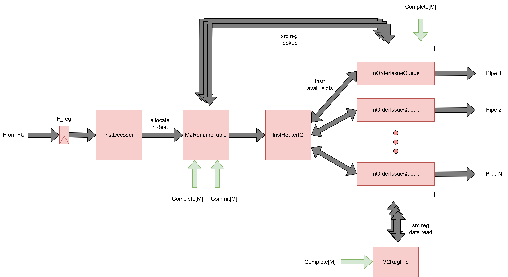

Decode Issue Unit (DIU)
==========================================================================

DIU L7
--------------------------------------------------------------------------

The level 7 Decode-Issue Unit (DIU L7) is responsibe for decoding instructions,
renaming architectural registers to physical registers, evaluating source
operand values, and issuing instructions to the appropriate pipe using issue
queues to allow for superscalar issue, which is the key improvement over the L6
DIU. To support this, the rename table now has two lookup ports for each issue
queue, such that operand ready status is looked up via the issue queues instead
of right after decoding. The register file now also has two read ports per issue
queue to allow for independent operand value reads. The issue queues support
single-cycle latency bypassing if the operand becomes ready via the complete
interface, as well as full queue bypassing for control XU's to keep the
single-cycle branch resolution latency.

Instruction Router for Issue Queues: InstRouterIQ
~~~~~~~~~~~~~~~~~~~~~~~~~~~~~~~~~~~~~~~~~~~~~~~~~~~~~~~~~~~~~~~~~~~~~~~~~~

The instruction router for issue queues (InstRouterIQ) is responsible for
directing each decoded instruction to the appropriate issue queue based on
which pipes support the instruction's micro-op and which queues have the most
available capacity. This is similar to the previous InstRouter used for
single-issue routing, but extended to handle the case where multiple issue
queues may support the same instruction.

The router is composed of two submodules. First, one ``InstRouterIQUnit`` is
instantiated per pipe, each parameterized with the ISA subset supported by that
pipe. Each unit checks whether the incoming micro-op is compatible with its
pipe's ISA subset using the ``in_subset`` function across all supported RISC-V
operations, producing a per-pipe ``iq_compat_op`` signal that is asserted when
the instruction is valid and the pipe supports it.

Second, the ``IQPicker`` module consumes the compatibility signals from all
router units along with the ``iq_avail_slots`` count from each issue queue. It
selects the compatible queue with the most available slots, breaking ties in
favor of the lowest-indexed pipe. The picker outputs a one-hot grant vector
(``iq_val``) indicating which queue the instruction should be sent to, as well
as an ``any_gnt`` signal indicating that at least one compatible queue was
found.

The top-level ``InstRouterIQ`` module asserts the ``xfer`` handshake signal
only when a compatible queue is selected and that queue's ``iq_rdy`` signal
indicates it can accept the instruction. This ensures backpressure is properly
propagated when all compatible queues are full.

In-Order Issue Queue: IssueQueueInOrder
~~~~~~~~~~~~~~~~~~~~~~~~~~~~~~~~~~~~~~~~~~~~~~~~~~~~~~~~~~~~~~~~~~~~~~~~~~

The in-order issue queue (IssueQueueInOrder) is a circular FIFO that buffers
decoded instructions and issues them to the execute stage strictly in program
order once both source operands are ready. Each issue queue has its own pair of
rename table lookup ports and register file read ports, enabling independent
operand resolution per queue.

The queue maintains insert and dequeue pointers (``ins_ptr`` and ``deq_ptr``)
to manage its circular buffer of entries. On insertion, the instruction's
decoded fields (micro-op, physical register addresses, immediate, PC, sequence
number, etc.) are stored at the insert pointer. The ``avail_slots`` output
communicates the remaining capacity to the InstRouterIQ for load-balancing
decisions.

On the dequeue side, the queue looks up the source physical registers of the
head-of-queue instruction in the rename table via the ``rt_lookup_pending``
signals. If neither source operand is pending (i.e., both are ready), the queue
asserts the dequeue handshake and drives the operand values read from the
register file onto the execute interface, along with the rest of the
instruction fields. In-order issue is enforced by only ever considering the
instruction at the dequeue pointer for issue.

The queue also supports a same-cycle bypass path: when the queue is empty and
both the insert and dequeue handshakes are active simultaneously, the incoming
instruction can bypass the entry storage entirely and be issued directly to the
execute stage, avoiding the one-cycle latency of writing to and reading from
the queue. This is particularly important for control-flow instructions (branch
and jump), where the bypass path (enabled via the ``p_bypass`` parameter) keeps
the branch resolution latency to a single cycle. When ``p_bypass`` is set, the
queue operates in a fully stateless mode, acting as a combinational
pass-through that gates the instruction based solely on operand readiness, with
no internal storage.

