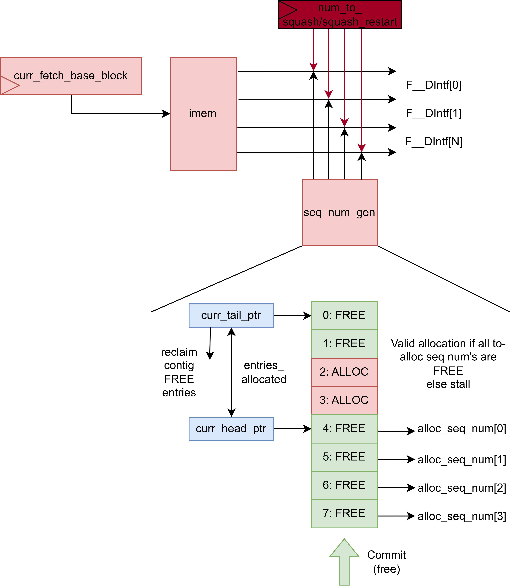
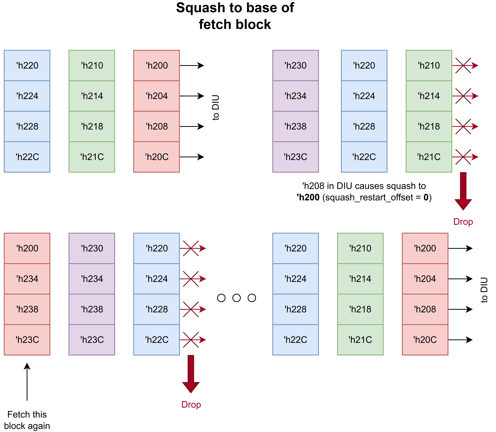
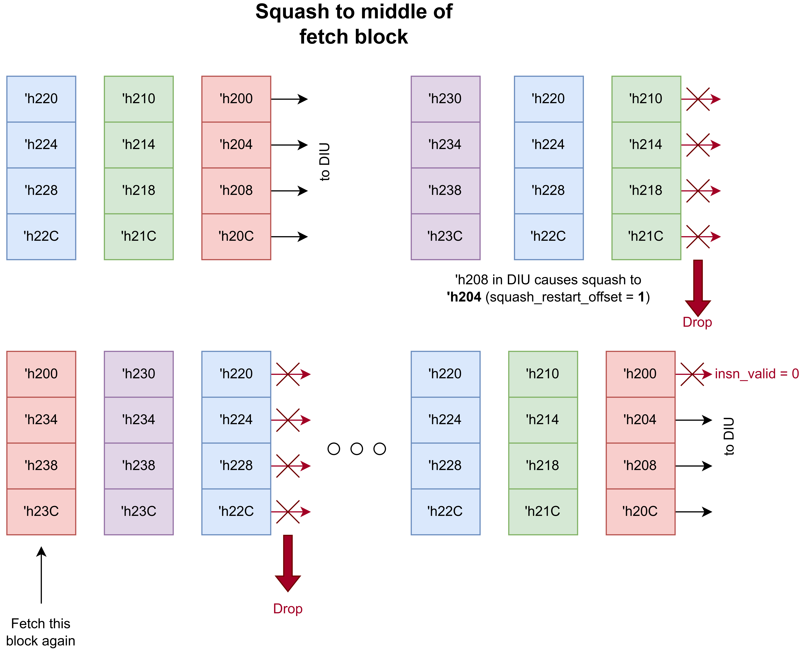

Fetch Unit
==========================================================================

FetchUnit L5
--------------------------------------------------------------------------

The Level 5 Fetch Unit (FetchUnitL5) is a FIFO-less superscalar fetch unit that
fetches aligned blocks of ``p_num_fe_lanes`` instructions per cycle and supports
squashing. As shown in the diagram below, the fetch unit sends a single wide
memory request per cycle and the response data is unpacked into
``p_num_fe_lanes`` instruction lanes that flow directly to the D interface with
no internal buffering. When a squash occurs, the unit tracks all in-flight
requests via ``num_to_squash`` and drops them as they return from memory, then
restarts fetching from the squash target address. The squash target is
decomposed into a fetch block base address (aligned to ``p_num_fe_lanes``
words) and a lane offset within that block, which determines which lanes in the
first post-squash fetch block carry valid instructions.

Each lane carries a 2-bit ``inst_status`` field (``READY`` or ``INVALID``) on
the ``F__DIntf`` interface. Lanes with valid instruction data are marked
``READY``; lanes that should be ignored (e.g., before the squash restart offset
or during a squash drop) are marked ``INVALID``. The downstream decode-issue
unit uses this status to skip invalid lanes without additional checking.

Superscalar Sequence Number Generator: SeqNumGenL5
~~~~~~~~~~~~~~~~~~~~~~~~~~~~~~~~~~~~~~~~~~~~~~~~~~~~~~~~~~~~~~~~~~~~~~~~~~

The SeqNumGenL5 module manages a circular buffer of ``2^p_seq_num_bits``
sequence numbers using a head and tail pointer. Each cycle, it can allocate up
to ``p_num_fe_lanes`` consecutive sequence numbers from the head pointer for
newly fetched instructions. Committed instructions are marked free via the
commit interface, and the tail pointer advances in-order over consecutive free
entries, reclaiming up to ``p_reclaim_width`` entries per cycle. On a squash,
all sequence numbers younger than the squash sequence number are freed and the
head pointer resets to ``squash.seq_num + 1``. Allocation can occur
simultaneously with a squash — the new sequence numbers start from the
post-squash head pointer position.

When the squash target address is aligned to the base of a fetch block (i.e.,
the lane offset is zero), the restart is straightforward. The fetch unit begins
requesting the aligned fetch block starting at the squash target, and since the
target corresponds to lane 0, all lanes in the first post-squash fetch block
contain valid instructions. The ``squash_restart_offset`` is zero, so
``D_inst_status`` and ``alloc_rdy`` are asserted for every lane, and each lane
receives a sequence number allocation as normal.

When the squash target address falls in the middle of a fetch block (i.e., the
lane offset is nonzero), the fetch unit still fetches the entire aligned block
but must invalidate the lanes before the target. The ``squash_restart_offset``
register captures which lane the squash target corresponds to, computed as the
word offset within the fetch block. On the first post-squash fetch block,
``D_inst_status`` is set to ``READY`` and ``alloc_rdy`` is asserted only for
lanes at or above ``squash_restart_offset`` — earlier lanes are marked
``INVALID`` and do not receive sequence number allocations. The
``needs_squash_restart`` flag ensures this partial-block behavior persists
until the first valid fetch block is transferred to decode, after which all
subsequent fetch blocks use all lanes normally.
